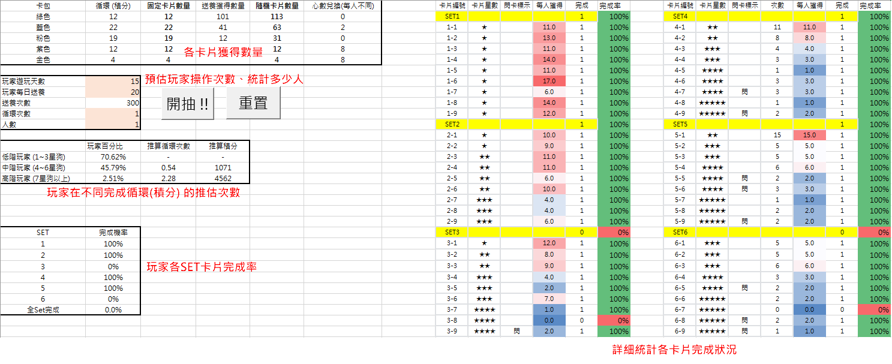

# Card-Pull-Simulator

A tool to analyze and visualize star ratings for card packs in a user-friendly interface.

### 專案簡介 Project Overview
統計多人抽卡包的結果，並分析各星級卡片的出現機率。  
This tool collects and analyzes card-pulling results from multiple players.

### 主要目的 Main Purpose
觀察各卡片組的完成概率，並提供相對應的獎勵。當所有組完成時，玩家可獲得大獎，並且需要控制大獎的完成率不至於太高。  
The goal is to observe the completion probability of each card set, where each set offers corresponding rewards. Completing all sets grants a grand prize, and the completion rate for the grand prize needs to be carefully controlled.

### 安裝與運行指導 Installation and Usage
下載 `Card_Pull_Simulator.xlsm` 檔案並在 Excel 中打開即可運行。  
To run the program, download the `Card_Pull_Simulator.xlsm` file and open it in Excel.

**按鈕說明 Buttons:**
- **開抽!!!**：開始運算（每次執行前會自動重置）。  
  Starts the simulation (it resets before each run).
- **重置**：重置所有狀態。  
  Resets all statuses.

**常用輸入參數 Common Input Parameters:**
- **玩家遊玩天數**：玩家可能會遊玩幾天。  
  Number of days a player is expected to play.
- **玩家每日送養**：玩家每天可能會完成幾次核心內容（例如：送養狗狗）。  
  Number of times a player completes the core content (e.g., rescuing dogs).
- **循環次數**：會有配套的卡包活動，循環到最後可獲得高稀有卡包，預設玩家會玩完一次循環。  
  Each cycle grants a high-rarity card pack; this parameter sets the expected cycle completion.
- **人數**：設置迴圈次數以模擬玩家人數。  
  Sets the number of simulation loops to represent the number of players.

### 主要功能模組 Main Modules
- **Main**：主體運算架構（抽卡包、換獎勵、再抽卡包、紀錄）及主迴圈。  
  Core simulation loop (pulls card packs, exchanges rewards, pulls again, and records results).
- **CardTypeProcessing**：處理卡包的抽取狀況（分為固定和隨機類型）。  
  Processes card pack pulls (fixed and random types).
- **Random**：生成隨機星數及 ID，主要由 CardTypeProcessing 使用。  
  Generates random star ratings and IDs, mainly used by CardTypeProcessing.
- **Record**：紀錄暫時資訊、完成狀況及觀察標的。  
  Records temporary information, completion status, and observation targets.
- **Reward**：將重複卡片轉為星星並換取獎勵（從高到低）。  
  Converts duplicate cards into star points, which are then exchanged for rewards (from high to low).
- **Reset**：重置整個專案或每次迴圈。  
  Resets the entire project or each simulation loop.
